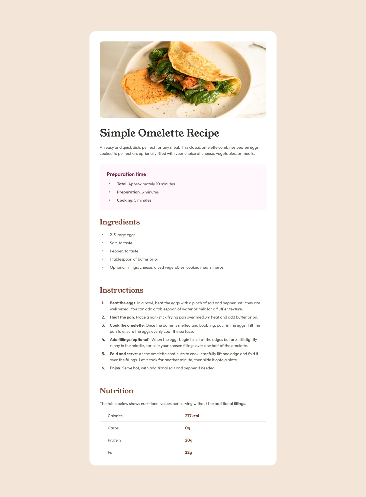
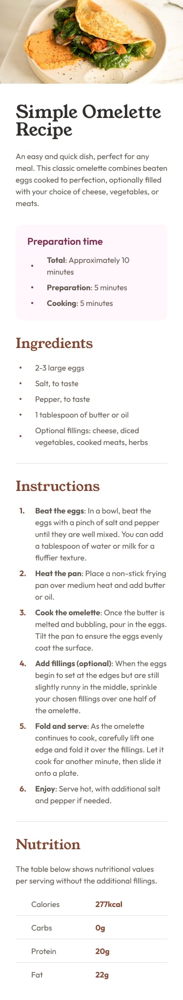

# Frontend Mentor - Recipe page solution

This is a solution to the [Recipe page challenge on Frontend Mentor](https://www.frontendmentor.io/challenges/recipe-page-KiTsR8QQKm). Frontend Mentor challenges help you improve your coding skills by building realistic projects.

## Table of contents

- [Overview](#overview)
  - [The challenge](#the-challenge)
  - [Screenshot](#screenshot)
  - [Links](#links)
- [My process](#my-process)
  - [Built with](#built-with)
  - [What I learned](#what-i-learned)
  - [Continued development](#continued-development)
  - [Useful resources](#useful-resources)
- [Author](#author)
- [Acknowledgments](#acknowledgments)

## Overview

### The challenge

Users should be able to:

- View the optimal layout depending on their device's screen size
- See hover states for interactive elements

### Screenshot

Desktop:

Mobile:

### Links

- Solution URL: [[https://github.com/Kelvyn94/blog-preview-card](https://github.com/Kelvyn94/Recipe-page)]
- Live Site URL: [Add live site URL here](https://your-live-site-url.com)

## My process

### Built with

- Semantic HTML5 markup
- CSS custom properties
- Flexbox
- Mobile-first workflow
- Google Fonts (Young Serif & Outfit)

### What I learned

This project helped me practice:

- Creating responsive layouts
- Working with Google Fonts
- Styling lists with custom markers
- Building tables without headers
- Using CSS counters for ordered lists

### Continued development

Future improvements:

- Add dark mode support
- Improve accessibility
- Add print styles

### Useful resources

- [Google Fonts](https://fonts.google.com/) - Used for Young Serif and Outfit fonts
- [Frontend Mentor](https://www.frontendmentor.io) - The challenge platform

## Author

- Frontend Mentor - [@Kelvyn94](https://www.frontendmentor.io/profile/Kelvyn94)
- GitHub - [@Kelvyn94](https://github.com/Kelvyn94)

## Acknowledgments

Thanks to Frontend Mentor for providing this challenge and the design assets.
